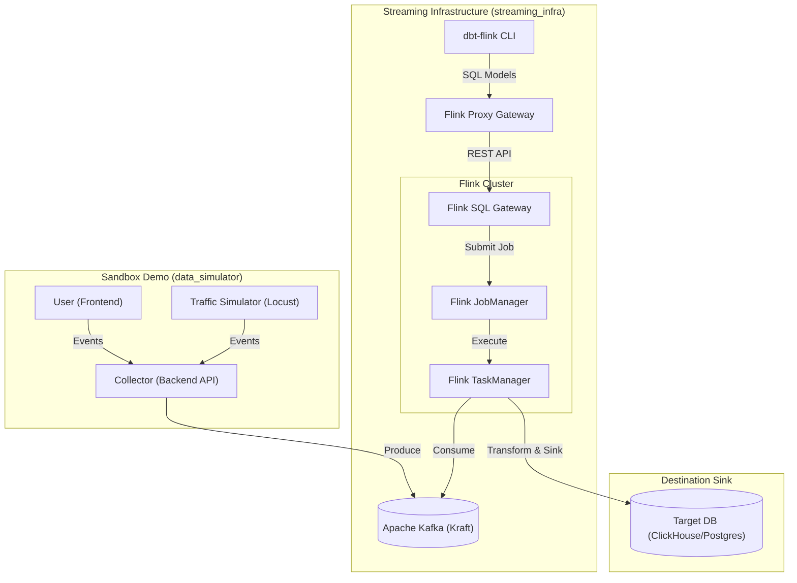

# 🌊 HydraStream: The Real-Time Data Engine

A high-performance streaming infrastructure designed to bridge the gap between SQL-based dbt models and Apache Flink's powerful streaming engine.

---

## 🚀 The Challenge: Why HydraStream?

Building real-time data pipelines is traditionally heavy, complex, and disconnected from the modern data stack. The "Data Community" faces several critical pain points:

*   **Infrastructure Complexity**: Manually orchestrating Kafka, Flink clusters, and SQL Gateways is a massive barrier to entry.
*   **The Language Gap**: Most data analysts are experts in SQL and dbt, but streaming often requires specialized Java/Scala knowledge.
*   **Slow Development Cycles**: Testing streaming logic against live data usually takes minutes or hours per iteration.
*   **Integration Friction**: Bridging raw event streams (Kafka) to analytics-ready warehouses (ClickHouse/PostgreSQL) with complex windowing is difficult to manage and version control.

**This project solves these by providing a "batteries-included" environment where streaming is treated exactly like batch: version-controlled SQL, dbt models, and automated testing.**

---

## 🏗️ Architecture Visualization



---

## 🧪 Quick Start: Test with Sample Data

Follow these steps to see a full real-time pipeline in action in under 5 minutes.

### 1. Start the Infrastructure
Spin up Kafka, Flink, and the dbt-flink proxy.
```bash
cd streaming_infra
docker compose up -d
```

### 2. Deploy the Streaming Models
Use dbt to create the Flink jobs that will process the data.
```bash
docker compose run dbt dbt run
```

### 3. Generate Traffic
Start the mock e-commerce storefront and the automated traffic simulator to pump events into Kafka.
```bash
cd ../data_simulator
docker compose up -d

# Optional: Run the simulator at high volume (50 concurrent users)
docker compose run simulator --users 50
```

### 4. Verify the Results
The data is now flowing from the **Simulator** -> **Kafka** -> **Flink (dbt)** -> **Destination Sink**.
*   **Flink Dashboard**: [http://localhost:8022](http://localhost:8022) to see the running jobs.
*   **Frontend Site**: [http://localhost:3000](http://localhost:3000) to click around manually.

---

## 🐳 Quick Start: Using Pre-Built Images

Skip the build step entirely and use the published images from Docker Hub.

**🔗 Docker Hub**: [https://hub.docker.com/r/blue2berry/hydrastream/tags](https://hub.docker.com/r/blue2berry/hydrastream/tags)

| Image | Tag | Pull Command |
| :--- | :--- | :--- |
| Flink Engine (JobManager + TaskManager + SQL Gateway) | `engine-flink1.19.1` | `docker pull blue2berry/hydrastream:engine-flink1.19.1` |
| Flink Proxy Gateway | `proxy-latest` | `docker pull blue2berry/hydrastream:proxy-latest` |
| dbt Worker | `dbt-latest` | `docker pull blue2berry/hydrastream:dbt-latest` |

### Step 1: Create a `.env` file

Create a `.env` file in your working directory with the following variables:
```env
# --- Kafka (use your own external cluster OR leave as-is for the bundled one) ---
KAFKA_TOPIC=clickstream
KAFKA_BOOTSTRAP_SERVERS=kafka:29092

# --- ClickHouse Sink (update with your own connection details) ---
CLICKHOUSE_JDBC_URL=jdbc:mysql://your.clickhouse.host:9004/your_database
CLICKHOUSE_USER=admin
CLICKHOUSE_PASSWORD=your_password
CLICKHOUSE_TARGET_TABLE=transformed_clickstream_metrics
```

### Step 2: Create a `docker-compose.yml`

Copy this into a new `docker-compose.yml` and run it in an empty directory:

```yaml
name: hydrastream

networks:
  streaming_net:
    name: streaming_net

services:
  # ── Bundled Kafka (remove this block if you use an external Kafka cluster) ──
  kafka:
    image: apache/kafka:3.9.0
    networks: [streaming_net]
    ports:
      - "9092:9092"
    environment:
      KAFKA_NODE_ID: 0
      KAFKA_PROCESS_ROLES: controller,broker
      KAFKA_CONTROLLER_QUORUM_VOTERS: 0@kafka:9093
      KAFKA_LISTENERS: PLAINTEXT://:29092,CONTROLLER://:9093,EXTERNAL://0.0.0.0:9092
      KAFKA_ADVERTISED_LISTENERS: PLAINTEXT://kafka:29092,EXTERNAL://localhost:9092
      KAFKA_LISTENER_SECURITY_PROTOCOL_MAP: CONTROLLER:PLAINTEXT,PLAINTEXT:PLAINTEXT,EXTERNAL:PLAINTEXT
      KAFKA_CONTROLLER_LISTENER_NAMES: CONTROLLER
      KAFKA_INTER_BROKER_LISTENER_NAME: PLAINTEXT
      KAFKA_AUTO_CREATE_TOPICS_ENABLE: "true"
    healthcheck:
      test: /opt/kafka/bin/kafka-topics.sh --bootstrap-server localhost:9092 --list
      interval: 10s
      retries: 15
      start_period: 60s

  # ── Flink Cluster ──────────────────────────────────────────────────────────
  flink-jobmanager:
    image: blue2berry/hydrastream:engine-flink1.19.1
    command: jobmanager
    networks: [streaming_net]
    ports:
      - "8022:8081"   # Flink Dashboard → http://localhost:8022
    environment:
      - |
        FLINK_PROPERTIES=
        jobmanager.rpc.address: flink-jobmanager
    depends_on:
      kafka:
        condition: service_healthy

  flink-taskmanager:
    image: blue2berry/hydrastream:engine-flink1.19.1
    command: taskmanager
    networks: [streaming_net]
    depends_on: [flink-jobmanager]
    environment:
      - |
        FLINK_PROPERTIES=
        jobmanager.rpc.address: flink-jobmanager
        taskmanager.numberOfTaskSlots: 2
        taskmanager.memory.process.size: 2048m

  flink-sql-gateway:
    image: blue2berry/hydrastream:engine-flink1.19.1
    command: /opt/flink/bin/sql-gateway.sh start-foreground
    networks: [streaming_net]
    ports:
      - "8083:8083"
    depends_on: [flink-jobmanager]
    environment:
      - |
        FLINK_PROPERTIES=
        jobmanager.rpc.address: flink-jobmanager
        sql-gateway.endpoint.rest.address: 0.0.0.0

  # ── Flink Proxy Gateway ────────────────────────────────────────────────────
  flink-proxy-gateway:
    image: blue2berry/hydrastream:proxy-latest
    networks: [streaming_net]
    ports:
      - "8080:8080"   # Proxy API → http://localhost:8080
    environment:
      PROXY_FLINK_GATEWAY_URL: http://flink-sql-gateway:8083
      PROXY_LISTEN_HOST: 0.0.0.0
      PROXY_LISTEN_PORT: 8080
    depends_on: [flink-sql-gateway]

  # ── dbt Worker (bring your own models) ────────────────────────────────────
  dbt:
    image: blue2berry/hydrastream:dbt-latest
    networks: [streaming_net]
    volumes:
      - ./models:/app/models   # Mount your local dbt models here
    environment:
      DBT_PROFILES_DIR: /app
      FLINK_PROXY_HOST: flink-proxy-gateway
      FLINK_PROXY_PORT: 8080
      KAFKA_TOPIC: ${KAFKA_TOPIC:-clickstream}
      CLICKHOUSE_JDBC_URL: ${CLICKHOUSE_JDBC_URL}
      CLICKHOUSE_USER: ${CLICKHOUSE_USER}
      CLICKHOUSE_PASSWORD: ${CLICKHOUSE_PASSWORD}
      CLICKHOUSE_TARGET_TABLE: ${CLICKHOUSE_TARGET_TABLE}
    depends_on: [flink-proxy-gateway]

volumes:
  kafka_data:
```

### Step 3: Start the Infrastructure

```bash
docker compose up -d
```

Check the **Flink Dashboard** at [http://localhost:8022](http://localhost:8022) to confirm the cluster is healthy.

### Step 4: Add Your dbt Models

Create a `models/` directory alongside your `docker-compose.yml` and place your Flink SQL dbt models inside. See the [dbt-flink Pattern section](#-understanding-the-dbt-flink-pattern) below for how to structure them.

```
my-project/
├── docker-compose.yml
├── .env
└── models/
    ├── raw_kafka_datasource.sql    ← Source model (Kafka schema)
    └── my_transformation.sql       ← Transformation model (Flink job)
```

### Step 5: Deploy Your Streaming Models

```bash
docker compose run dbt dbt run
```

This submits your SQL models as long-running Flink jobs. You can monitor them live in the Flink Dashboard.

---

## 🛠️ Components Deep-Dive

### 1. Streaming Infrastructure (`streaming_infra/`)
The core engine. It uses:
*   **Apache Kafka**: Ingestion layer (Kraft mode).
*   **Apache Flink**: Transformation layer (windowing, aggregations).
*   **dbt-flink-adapter**: Allows you to write Flink SQL as dbt models.
*   **Flink Proxy Gateway**: Bridges the gap for standard dbt commands.

#### Connecting Your Own Database (e.g., ClickHouse)
Configure your `.env` file in `streaming_infra`:
```bash
CLICKHOUSE_JDBC_URL="jdbc:mysql://your.clickhouse.host/db"
CLICKHOUSE_USER="admin"
CLICKHOUSE_TARGET_TABLE="transformed_metrics"
```

> [!IMPORTANT]
> **Schema Management**: Flink creates mapping metadata in its own catalog but **does not** create physical tables in your destination database. You must create the target table (sink) in ClickHouse/Postgres/etc. before starting the dbt run.

### 2. The Sandbox Demo (`data_simulator/`)
The interactive part of the project.
*   **Backend/Collector**: Receives events from the frontend and pushes to Kafka.
*   **Frontend**: A simple React app to simulate user behavior.
*   **Simulator**: A Python script using `locust` or similar to generate massive clickstream load.

---

## 📖 Understanding the dbt-flink Pattern

A common question is: **"Why does every datastream have two models?"**

In the `dbt-flink` world, we split logic into **Sources** and **Transformation/Sinks** to maintain a clean separation between "how to read" and "what to do."

### 1. The Two-Model Architecture

| Model type | Materialization | Purpose |
| :--- | :--- | :--- |
| **Source Model** | `streaming_source` | **DDL Only**. Defines the schema, data types, and watermark strategy for your incoming Kafka topic. It doesn't trigger a Flink job; it simply registers the topic in the Flink catalog. |
| **Transformation Model** | `streaming_table` | **Job Submission**. Contains the `SELECT` logic (windowing, aggregations). It uses `{{ ref() }}` to point to a source and includes the `with` config to define the **Sink** (where the data goes, e.g., ClickHouse). |

> [!TIP]
> Think of the **Source Model** as your connection string and schema, and the **Transformation Model** as your actual long-running streaming application.

---

### 2. ⚠️ Required: Define Your Raw Data Schema (Flink DDL)

> [!IMPORTANT]
> Unlike standard dbt batch models, **Flink cannot infer schema from your data**. You must explicitly declare every column, its SQL data type, and a watermark strategy in your **Source Model**. This is a hard requirement — without it, the DDL statement sent to Flink will fail.

The source model is a pure **Flink DDL definition**. It tells Flink:
- What fields exist in the Kafka JSON payload
- What SQL type each field is
- Which field represents event time (for windowed aggregations)
- How long to wait for late-arriving events (watermark)

#### Example Source Model (`models/raw_kafka_datasource.sql`)

```sql
{{ config(
    materialized='streaming_source',
    connector='kafka',
    with={
        'topic':                          env_var('KAFKA_TOPIC', 'clickstream'),
        'properties.bootstrap.servers':   env_var('KAFKA_BOOTSTRAP_SERVERS', 'kafka:29092'),
        'properties.group.id':            'hydrastream-group',
        'scan.startup.mode':              'earliest-offset',
        'format':                         'json'
    }
) }}

-- ⚠️ Every field in your Kafka JSON payload must be declared here.
-- Flink uses this as the DDL for the source table — it does NOT infer schema.
SELECT
    session_id          STRING,           -- unique session identifier
    user_id             STRING,           -- anonymised user ID
    page_url            STRING,           -- page the event was fired on
    event_type          STRING,           -- e.g. 'click', 'view', 'purchase'
    product_id          STRING,           -- optional: item involved
    revenue             DOUBLE,           -- optional: monetary value
    event_time          TIMESTAMP(3),     -- ⚠️ MUST match the field name used in WATERMARK below
    WATERMARK FOR event_time AS event_time - INTERVAL '5' SECOND  -- tolerate 5s late arrivals
```

> [!WARNING]
> **Common mistakes to avoid:**
> - **Missing fields**: If a field exists in your Kafka payload but is not declared here, it will be silently dropped. Any downstream model that references it will fail.
> - **Wrong types**: Flink is strict. A JSON number field mapped to `STRING` will cause a runtime deserialization error. Always match the JSON payload type exactly.
> - **No `WATERMARK`**: Without a watermark declaration, time-windowed aggregations (`TUMBLE`, `HOP`, `SESSION`) will never emit results.
> - **Field name mismatch**: The field used in `WATERMARK FOR <field>` must be declared in the same `SELECT` list with type `TIMESTAMP(3)`.

#### Matching Your Kafka Payload to SQL Types

| JSON Payload Type | Recommended Flink SQL Type |
| :--- | :--- |
| `"value": "text"` | `STRING` |
| `"value": 42` | `BIGINT` or `INT` |
| `"value": 3.14` | `DOUBLE` or `DECIMAL(10, 2)` |
| `"value": true` | `BOOLEAN` |
| `"value": "2024-01-01T12:00:00"` | `TIMESTAMP(3)` (parsed via `json.timestamp-format.standard: 'ISO-8601'`) |
| `"value": 1704067200000` (epoch ms) | `BIGINT` → cast to `TIMESTAMP(3)` using `TO_TIMESTAMP_LTZ(value, 3)` |

---

### 2. Kafka Configuration Deep-Dive

In your `streaming_source` models, you'll see a `with` block. Here is what those parameters do:

| Parameter | Recommended Value | Why? |
| :--- | :--- | :--- |
| `connector` | `'kafka'` | Tells Flink to use the optimized Kafka source connector. |
| `topic` | `your_topic` | The exact name of the Kafka topic. |
| `properties.bootstrap.servers` | `kafka:29092` | The address of your Kafka brokers. |
| `properties.group.id` | `flink-group` | The consumer group ID. This is vital for Flink to track "where it is" in the stream (offsets). |
| `scan.startup.mode` | `'earliest-offset'` | Controls where the job starts reading. `earliest` starts from the beginning of time; `latest` starts only from new messages. |
| `format` | `'json'` | Specifies the payload format. Common options include `json`, `avro`, or `csv`. |

#### 🌊 The Power of Watermarks
In `raw_kafka_datasource.sql`, you'll notice:
```sql
WATERMARK FOR event_time AS event_time - INTERVAL '5' SECOND
```
This is the most critical line for streaming. It tells Flink: *"Wait up to 5 seconds for late-arriving events before closing the time window."* Without this, your real-time aggregations would be inaccurate.

---

### 🔌 Connecting an Existing Kafka Cluster

If you already have a Kafka cluster (e.g., Confluent Cloud, Amazon MSK, or a self-hosted cluster) and only want to use **HydraStream** for the **Flink + dbt** processing layer, follow these steps:

#### 1. Disable the Local Kafka Service
You don't need the bundled Kafka container. In `streaming_infra/docker-compose.yml`, you can comment out or remove the `kafka` service block to save resources.

#### 2. Configure Environment Variables
Update your `streaming_infra/.env` file with your external cluster details:
```env
# Example: Confluent Cloud or Remote Kafka
KAFKA_BOOTSTRAP_SERVERS=pkc-xxxx.us-east-1.aws.confluent.cloud:9092
KAFKA_TOPIC=your_existing_topic_name
```

#### 3. Update Security & Authentication
If your production Kafka requires SSL or SASL (standard for cloud providers), you must update the `with` block in your **Source Model** (`raw_kafka_datasource.sql`):

```sql
{{ config(
    materialized='streaming_source',
    connector='kafka',
    with={
        'topic': env_var('KAFKA_TOPIC'),
        'properties.bootstrap.servers': env_var('KAFKA_BOOTSTRAP_SERVERS'),
        'properties.security.protocol': 'SASL_SSL',
        'properties.sasl.mechanism': 'PLAIN',
        'properties.sasl.jaas.config': 'org.apache.kafka.common.security.plain.PlainLoginModule required username="YOUR_API_KEY" password="YOUR_API_SECRET";'
    }
) }}
```

#### 4. Network Connectivity
Ensure the **Flink TaskManager** container can reach your Kafka endpoint.
- If Kafka is on the **same host**, use `host.docker.internal:9092`.
- If Kafka is **remote**, ensure your network firewalls allow traffic from your Flink cluster IP range.

---

## 🏁 Deploying to Production

---

## 📜 Legal & Trademarks

HydraStream is an independent project and is not affiliated with, sponsored by, or endorsed by dbt Labs, Inc. or the Apache Software Foundation.

*   **dbt™** is a trademark of dbt Labs, Inc.
*   **Apache Flink®**, **Apache Kafka®**, and the Apache projects are trademarks of the [Apache Software Foundation](https://www.apache.org/).

HydraStream is provided "as is" under the Apache License 2.0. Any third-party drivers downloaded dynamically at runtime are subject to their respective licenses.

