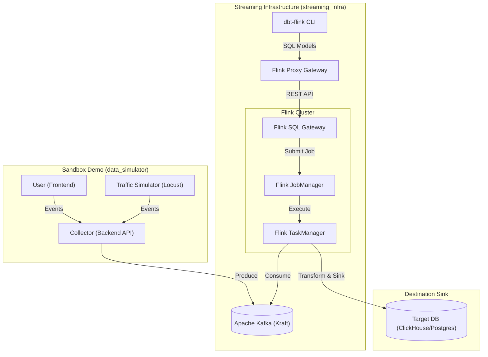

# 🌊 HydraStream: The Real-Time Data Engine

A high-performance streaming infrastructure designed to bridge the gap between SQL-based dbt models and Apache Flink's powerful streaming engine.

---

## 🚀 The Challenge: Why HydraStream?

Building real-time data pipelines is traditionally heavy, complex, and disconnected from the modern data stack. The "Data Community" faces several critical pain points:

*   **Infrastructure Complexity**: Manually orchestrating Kafka, Flink clusters, and SQL Gateways is a massive barrier to entry.
*   **The Language Gap**: Most data analysts are experts in SQL and dbt, but streaming often requires specialized Java/Scala knowledge.
*   **Slow Development Cycles**: Testing streaming logic against live data usually takes minutes or hours per iteration.
*   **Integration Friction**: Bridging raw event streams (Kafka) to analytics-ready warehouses (ClickHouse/PostgreSQL) with complex windowing is difficult to manage and version control.

**This project solves these by providing a "batteries-included" environment where streaming is treated exactly like batch: version-controlled SQL, dbt models, and automated testing.**

---

## 🏗️ Architecture Visualization



---

## 🧪 Quick Start: Test with Sample Data

Follow these steps to see a full real-time pipeline in action in under 5 minutes.

### 1. Start the Infrastructure
Spin up Kafka, Flink, and the dbt-flink proxy.
```bash
cd streaming_infra
docker compose up -d
```

### 2. Deploy the Streaming Models
Use dbt to create the Flink jobs that will process the data.
```bash
docker compose run dbt dbt run
```

### 3. Generate Traffic
Start the mock e-commerce storefront and the automated traffic simulator to pump events into Kafka.
```bash
cd ../data_simulator
docker compose up -d

# Optional: Run the simulator at high volume (50 concurrent users)
docker compose run simulator --users 50
```

### 4. Verify the Results
The data is now flowing from the **Simulator** -> **Kafka** -> **Flink (dbt)** -> **Destination Sink**.
*   **Flink Dashboard**: [http://localhost:8022](http://localhost:8022) to see the running jobs.
*   **Frontend Site**: [http://localhost:3000](http://localhost:3000) to click around manually.

---

## 🐳 Quick Start: Using Pre-Built Images
If you do not want to build the images from source, you can use our pre-built distributed images. This significantly speeds up onboarding and eliminates the need for local Java or Python environments.

1.  **Run the Engine and Proxy**:
    Use the provided pre-built images in a `docker-compose.yml`:
    ```yaml
    services:
      hydrastream-engine:
        image: hydrastream/engine:flink1.19.1
        environment:
          - KAFKA_TOPIC=my-topic
          - CLICKHOUSE_JDBC_URL=jdbc:mysql://my-host:9004/db

      hydrastream-proxy:
        image: hydrastream/proxy:latest
    ```

2.  **Execute your Custom dbt Models**:
    Mount your local dbt project directory into the pre-built dbt-worker image:
    ```bash
    # Run from the directory where your specialized dbt models are located
    docker run --network host \
        -v $(pwd)/models:/app/models \
        -e FLINK_PROXY_HOST=localhost \
        hydrastream/dbt-worker:latest dbt run
    ```

---

## 🛠️ Components Deep-Dive

### 1. Streaming Infrastructure (`streaming_infra/`)
The core engine. It uses:
*   **Apache Kafka**: Ingestion layer (Kraft mode).
*   **Apache Flink**: Transformation layer (windowing, aggregations).
*   **dbt-flink-adapter**: Allows you to write Flink SQL as dbt models.
*   **Flink Proxy Gateway**: Bridges the gap for standard dbt commands.

#### Connecting Your Own Database (e.g., ClickHouse)
Configure your `.env` file in `streaming_infra`:
```bash
CLICKHOUSE_JDBC_URL="jdbc:mysql://your.clickhouse.host/db"
CLICKHOUSE_USER="admin"
CLICKHOUSE_TARGET_TABLE="transformed_metrics"
```

> [!IMPORTANT]
> **Schema Management**: Flink creates mapping metadata in its own catalog but **does not** create physical tables in your destination database. You must create the target table (sink) in ClickHouse/Postgres/etc. before starting the dbt run.

### 2. The Sandbox Demo (`data_simulator/`)
The interactive part of the project.
*   **Backend/Collector**: Receives events from the frontend and pushes to Kafka.
*   **Frontend**: A simple React app to simulate user behavior.
*   **Simulator**: A Python script using `locust` or similar to generate massive clickstream load.

---

## 📖 Understanding the dbt-flink Pattern

A common question is: **"Why does every datastream have two models?"**

In the `dbt-flink` world, we split logic into **Sources** and **Transformation/Sinks** to maintain a clean separation between "how to read" and "what to do."

### 1. The Two-Model Architecture

| Model type | Materialization | Purpose |
| :--- | :--- | :--- |
| **Source Model** | `streaming_source` | **DDL Only**. Defines the schema, data types, and watermark strategy for your incoming Kafka topic. It doesn't trigger a Flink job; it simply registers the topic in the Flink catalog. |
| **Transformation Model** | `streaming_table` | **Job Submission**. Contains the `SELECT` logic (windowing, aggregations). It uses `{{ ref() }}` to point to a source and includes the `with` config to define the **Sink** (where the data goes, e.g., ClickHouse). |

> [!TIP]
> Think of the **Source Model** as your connection string and schema, and the **Transformation Model** as your actual long-running streaming application.

---

### 2. Kafka Configuration Deep-Dive

In your `streaming_source` models, you'll see a `with` block. Here is what those parameters do:

| Parameter | Recommended Value | Why? |
| :--- | :--- | :--- |
| `connector` | `'kafka'` | Tells Flink to use the optimized Kafka source connector. |
| `topic` | `your_topic` | The exact name of the Kafka topic. |
| `properties.bootstrap.servers` | `kafka:29092` | The address of your Kafka brokers. |
| `properties.group.id` | `flink-group` | The consumer group ID. This is vital for Flink to track "where it is" in the stream (offsets). |
| `scan.startup.mode` | `'earliest-offset'` | Controls where the job starts reading. `earliest` starts from the beginning of time; `latest` starts only from new messages. |
| `format` | `'json'` | Specifies the payload format. Common options include `json`, `avro`, or `csv`. |

#### 🌊 The Power of Watermarks
In `raw_kafka_datasource.sql`, you'll notice:
```sql
WATERMARK FOR event_time AS event_time - INTERVAL '5' SECOND
```
This is the most critical line for streaming. It tells Flink: *"Wait up to 5 seconds for late-arriving events before closing the time window."* Without this, your real-time aggregations would be inaccurate.

---

### 🔌 Connecting an Existing Kafka Cluster

If you already have a Kafka cluster (e.g., Confluent Cloud, Amazon MSK, or a self-hosted cluster) and only want to use **HydraStream** for the **Flink + dbt** processing layer, follow these steps:

#### 1. Disable the Local Kafka Service
You don't need the bundled Kafka container. In `streaming_infra/docker-compose.yml`, you can comment out or remove the `kafka` service block to save resources.

#### 2. Configure Environment Variables
Update your `streaming_infra/.env` file with your external cluster details:
```env
# Example: Confluent Cloud or Remote Kafka
KAFKA_BOOTSTRAP_SERVERS=pkc-xxxx.us-east-1.aws.confluent.cloud:9092
KAFKA_TOPIC=your_existing_topic_name
```

#### 3. Update Security & Authentication
If your production Kafka requires SSL or SASL (standard for cloud providers), you must update the `with` block in your **Source Model** (`raw_kafka_datasource.sql`):

```sql
{{ config(
    materialized='streaming_source',
    connector='kafka',
    with={
        'topic': env_var('KAFKA_TOPIC'),
        'properties.bootstrap.servers': env_var('KAFKA_BOOTSTRAP_SERVERS'),
        'properties.security.protocol': 'SASL_SSL',
        'properties.sasl.mechanism': 'PLAIN',
        'properties.sasl.jaas.config': 'org.apache.kafka.common.security.plain.PlainLoginModule required username="YOUR_API_KEY" password="YOUR_API_SECRET";'
    }
) }}
```

#### 4. Network Connectivity
Ensure the **Flink TaskManager** container can reach your Kafka endpoint.
- If Kafka is on the **same host**, use `host.docker.internal:9092`.
- If Kafka is **remote**, ensure your network firewalls allow traffic from your Flink cluster IP range.

---

## 🏁 Deploying to Production

---

## 📜 Legal & Trademarks

HydraStream is an independent project and is not affiliated with, sponsored by, or endorsed by dbt Labs, Inc. or the Apache Software Foundation.

*   **dbt™** is a trademark of dbt Labs, Inc.
*   **Apache Flink®**, **Apache Kafka®**, and the Apache projects are trademarks of the [Apache Software Foundation](https://www.apache.org/).

HydraStream is provided "as is" under the Apache License 2.0. Any third-party drivers downloaded dynamically at runtime are subject to their respective licenses.

