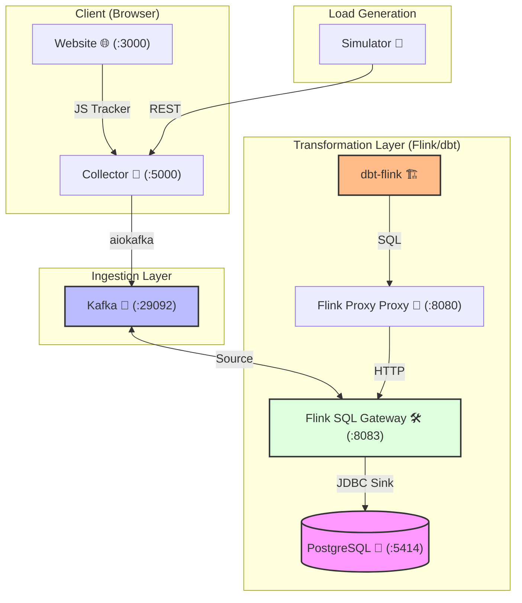
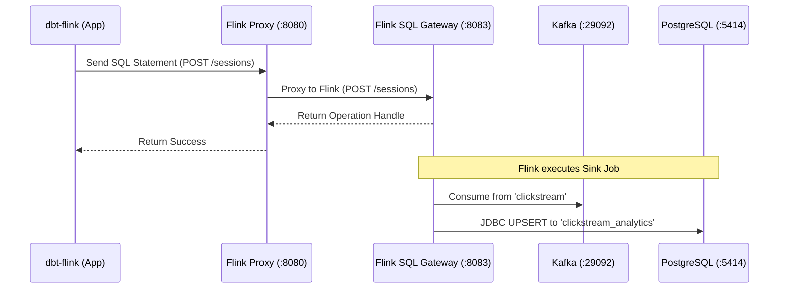

# Clickstream Tracking Project

A complete, dockerized near-real-time clickstream tracking pipeline built around a simulated ecommerce experience ("Nexus Market").

---

## Architecture



## Project Structure

| Directory | Component | Description |
|---|---|---|
| `website/` | **Frontend** | Simulated ecommerce storefront ("Nexus Market") with `tracker.js` |
| `collector/` | **Ingestion** | FastAPI service validating and pushing events to Kafka |
| `dbt/` | **Transform** | dbt project defining Flink SQL streaming models and JDBC sinks |
| `infra/flink-proxy-gateway/` | **Orchestra** | Custom proxy enabling dbt (Confluent adapter) ↔ OSS Flink Gateway |
| `simulator/` | **Load Test** | Python script generating synthetic user journeys (weighted) |
| `infra/` | **Config** | SQL initialization scripts and proxy source code |
| `flink/` | **Runtime** | Custom Docker image for Flink (JobManager, TaskManager, Gateway) |

---

## 1. Website — Tracked Activities

The `NexusTracker` library (`tracker.js`) captures two categories of events:

### 1.1 Automatic Events

These fire without any manual instrumentation, captured by a global DOM listener.

| Event Type | Trigger | Data Payload |
|---|---|---|
| `click` | User clicks any `<button>` or `<a>` element | `element_id`, `element_text`, `classes` |

### 1.2 Explicit Business Events

These are fired at specific points in the user journey within `main.js`.

| Event Type | Trigger | Data Payload | Funnel Stage |
|---|---|---|---|
| `page_view` | User navigates to any section | `page` (e.g. `home`, `cart`, `checkout`) | Awareness |
| `add_to_cart` | User clicks "Add to Cart" on a product | `product_id`, `product_name`, `price` | Interest |
| `remove_from_cart` | User clicks "Remove" in cart | `product_id` | Interest (negative) |
| `checkout_start` | User clicks "Proceed to Checkout" | `cart_size`, `total` | Consideration |
| `checkout_step` | User completes shipping form → payment | `step` (e.g. `payment`) | Consideration |
| `purchase_success` | User clicks "Pay Now" (success) | `order_id`, `total` | Conversion |
| `purchase_failed` | User clicks "Simulate Failure" | `reason` (e.g. `insufficient_funds`) | Drop-off |
| `retry_payment` | User clicks "Retry Payment" after failure | — | Recovery |

### 1.3 Event Schema (sent to Collector)

Every event sent to the collector follows this JSON structure:

```json
{
  "event_type": "add_to_cart",
  "page_url": "http://localhost:3000/index.html",
  "user_id": "user_k7x9m2p4q",
  "session_id": "sess_a3b8f1c2e",
  "data": {
    "product_id": "prod_001",
    "product_name": "Aero-Flow Runners",
    "price": 189.99
  },
  "timestamp": "2026-03-28T14:10:00.000Z"
}
```

| Field | Type | Source | Description |
|---|---|---|---|
| `event_type` | `string` | `main.js` | Identifies what happened |
| `page_url` | `string` | `tracker.js` | Full browser URL at time of event |
| `user_id` | `string` | `tracker.js` | Random per-browser-session user ID |
| `session_id` | `string` | `tracker.js` | Random per-page-load session ID |
| `data` | `object` | `main.js` | Event-specific payload (varies by type) |
| `timestamp` | `string` | `tracker.js` | ISO 8601 timestamp from client |

### 1.4 Derivable Metrics

| Metric | How to Calculate | Business Value |
|---|---|---|
| **Page Views per Session** | `COUNT(page_view) GROUP BY session_id` | Engagement depth |
| **Add-to-Cart Rate** | `COUNT(add_to_cart) / COUNT(page_view WHERE page='home')` | Product interest |
| **Cart Abandonment Rate** | `1 - (COUNT(checkout_start) / COUNT(add_to_cart))` | Friction detection |
| **Checkout Abandonment Rate** | `1 - (COUNT(purchase_success) / COUNT(checkout_start))` | Payment friction |
| **Conversion Rate (E2E)** | `COUNT(purchase_success) / COUNT(DISTINCT session_id)` | Overall funnel health |
| **Average Order Value** | `AVG(total) FROM purchase_success events` | Revenue optimization |
| **Failure Rate** | `COUNT(purchase_failed) / (COUNT(purchase_success) + COUNT(purchase_failed))` | Payment reliability |
| **Retry Rate** | `COUNT(retry_payment) / COUNT(purchase_failed)` | User persistence |
| **Top Clicked Elements** | `COUNT(*) GROUP BY element_id WHERE event_type='click'` | UX hotspot analysis |
| **Session Duration** | `MAX(timestamp) - MIN(timestamp) GROUP BY session_id` | Engagement time |
| **Product Popularity** | `COUNT(add_to_cart) GROUP BY product_id` | Demand signal |
| **Remove-from-Cart Rate** | `COUNT(remove_from_cart) / COUNT(add_to_cart)` | Buyer's remorse signal |

---

## 2. Collector Layer — Event Ingestion

The collector is a **FastAPI** application (`collector/main.py`) that acts as the bridge between the frontend and Kafka.

### 2.1 API Endpoint

| Method | Path | Description |
|---|---|---|
| `POST` | `/events` | Receives a single click event, validates it, and produces it to Kafka |
| `GET` | `/health` | Returns `{"status": "healthy"}` for container healthchecks |

### 2.2 Request Validation (Pydantic)

The collector validates every incoming event against the `ClickEvent` model:

```python
class ClickEvent(BaseModel):
    event_type: str            # Required — e.g. "page_view", "add_to_cart"
    page_url: str              # Required — full URL from browser
    user_id: str               # Required — client-generated user identifier
    session_id: str            # Required — client-generated session identifier
    element_id: str = None     # Optional — DOM element id (for click events)
    element_text: str = None   # Optional — visible text of clicked element
    product_id: str = None     # Optional — product identifier (cart/purchase events)
    data: Dict[str, Any] = {}  # Optional — flexible payload for event-specific data
    timestamp: str = None      # Optional — ISO 8601; server fills if missing
```

> Invalid payloads (e.g. missing `event_type`) receive a `422 Unprocessable Entity` response.

### 2.3 Kafka Production

| Config | Value | Source |
|---|---|---|
| Bootstrap Servers | `kafka:29092` | `KAFKA_BOOTSTRAP_SERVERS` env var |
| Topic | `clickstream` | `KAFKA_TOPIC` env var |
| Serialization | JSON (`json.dumps().encode('utf-8')`) | Hardcoded |
| Library | `aiokafka` (async) | Non-blocking I/O |

**Flow:**
1. Event arrives at `POST /events`
2. Pydantic validates the payload → rejects with `422` if invalid
3. Server-side timestamp backfill if `timestamp` is `null`
4. `AIOKafkaProducer.send_and_wait()` produces to the `clickstream` topic
5. Returns `{"status": "ok"}` on success, `500` on Kafka failure

### 2.4 Collector Observability

| Signal | Implementation |
|---|---|
| Structured Logging | Every event logged with `event_type` and `session_id` |
| Health Endpoint | `GET /health` for Docker/K8s probes |
| Error Handling | Kafka failures return HTTP 500 with error detail |
| CORS | `allow_origins=["*"]` — permits requests from any frontend origin |

---

## 3. Connection Flow & Infrastructure

The pipeline follows a specific orchestration path where **dbt** manages the SQL lifecycle, but **Flink** handles the actual streaming execution and data movement.

### 3.1 Orchestration Chain



### 3.2 Where Each Connection is Configured

| Layer | Connects To | Configured In | Key Settings |
|---|---|---|---|
| **dbt** | Flink Proxy Gateway (`:8080`) | `dbt/profiles.yml` | `host`, `organization_id`, `environment_id` |
| **Flink Proxy** | Flink SQL Gateway (`:8083`) | `docker-compose.yml` | `PROXY_FLINK_GATEWAY_URL` |
| **Flink → source** | Kafka (`:29092`) | `dbt/models/clickstream_raw.sql` | `'connector' = 'kafka'`, `'properties.bootstrap.servers'` |
| **Flink → sink** | PostgreSQL (`:5414`) | `dbt/models/clickstream_summary.sql` | `'connector' = 'jdbc'`, `'url'`, `'table-name'`, `'username'` |

### 3.3 PostgreSQL Credentials (Host-Level)

The PostgreSQL instance runs on the host machine (accessibble via `host.docker.internal:5414` from within Docker).

| Credential | Value | Role |
|---|---|---|
| **Host** | `host.docker.internal:5414` | Target Database Address |
| **Database** | `postgres` | Physical DB Name |
| **Schema** | `clickstream` | Logical Isolation |
| **User** | `data_eng` | ETL Runner |
| **Password** | `12345pP` | Authentication |

> **Note:** Initial schema setup is defined in [init_postgres.sql](file:///home/blueberry/Desktop/clickstream/infra/init_postgres.sql).

### 3.4 dbt Profile (Proxy Connection Only)

`dbt/profiles.yml` configures the connection to **Flink** through the proxy. It uses the `confluent-sql` adapter to talk to the Flink SQL Gateway's REST API:

```yaml
clickstream:
  outputs:
    dev:
      type: confluent
      host: http://flink-proxy-gateway:8080   # Proxy URL (Docker network)
      organization_id: nexus-org               # Flink Catalog Namespace
      environment_id: default_catalog          # Maps to Flink catalog
      dbname: default_database                 # Maps to Flink database
```

---

## 4. Getting Started

### Prerequisites
- **Docker & Docker Compose** (Tested with Engine 25.x+)
- **Local PostgreSQL** running on port `5414` (Exposed to Docker via `host-gateway`)
- **Flink SQL Gateway** (Automatically starts via Docker Compose)

### Launch the Stack
```bash
# 1. Ensure Postgres is running locally
# 2. Start the core services
docker compose up -d
```

### Run dbt Transformations
```bash
docker compose run dbt dbt run
```

### Access the Website
Open `http://localhost:3000` in your browser and interact with the shop.

### Configuration
Edit `.env` to change service endpoints:
```bash
FLINK_GATEWAY_URL=http://flink-sql-gateway:8083
POSTGRES_HOST=host.docker.internal
POSTGRES_PORT=5414
```

---

## 5. Traffic Simulator

A dockerized service that generates mock users with randomized ecommerce journeys. It does **not** visit the website — it sends events directly to the collector API, simulating what the `NexusTracker` would send from a real browser.

### 5.1 Usage

The simulator uses a Docker Compose **profile** so it won't start with `docker compose up`. Run it on-demand:

```bash
docker compose --profile simulate run --rm simulator --users 20 2>&1 | tee simulator.log
```

```bash
# 20 users (default)
docker compose --profile simulate run --rm simulator

# 50 users
docker compose --profile simulate run --rm simulator --users 50

# 100 users, faster pace
docker compose --profile simulate run --rm simulator --users 100 --pace 0.1
```

Or via environment variables in `.env`:
```bash
SIMULATOR_USERS=50
SIMULATOR_PACE=0.2
```

### 5.2 Journey Types

Each mock user randomly follows one of these weighted journey types:

| Journey | Weight | Steps | Simulates |
|---|---|---|---|
| **Browser** | 40% | Browse products, click around | Window shoppers |
| **Cart Abandoner** | 25% | Browse → Add to cart → Leave | Users who add but don't checkout |
| **Checkout Abandoner** | 15% | Browse → Cart → Start checkout → Leave | Users who drop off at shipping/payment |
| **Successful Buyer** | 10% | Browse → Cart → Checkout → Pay ✓ | Completed purchases |
| **Failed Buyer** | 5% | Browse → Cart → Checkout → Pay ✗ | Payment failures |
| **Retry Buyer** | 5% | Browse → Cart → Checkout → Fail → Retry → Pay ✓ | Recovered purchases |

### 5.3 Events Generated per Journey

| Journey | Approx. Events | Event Types Fired |
|---|---|---|
| Browser | 3–6 | `page_view`, `click` |
| Cart Abandoner | 6–12 | `page_view`, `click`, `add_to_cart`, `remove_from_cart` |
| Checkout Abandoner | 8–14 | + `checkout_start`, `checkout_step` |
| Successful Buyer | 10–16 | + `purchase_success` |
| Failed Buyer | 10–16 | + `purchase_failed` |
| Retry Buyer | 12–20 | + `retry_payment`, `purchase_success` |

### 5.4 Configuration Reference

| Variable | Default | Description |
|---|---|---|
| `SIMULATOR_USERS` | `20` | Number of concurrent simulated users |
| `SIMULATOR_COLLECTOR_URL` | `http://collector:5000/events` | Collector endpoint |
| `SIMULATOR_PACE` | `0.3` | Seconds between actions (lower = faster) |

---

---

## 6. Infrastructure Hardening & Performance

The pipeline includes several reliability features implemented during the ClickHouse → PostgreSQL migration:

- **Enhanced Timeouts**: `httpx` timeouts in the Flink Proxy Gateway and the `confluent-sql` library are set to **300s** to handle complex Flink job submissions.
- **JDBC Persistence**: The PostgreSQL sink uses standard JDBC connectors with automatic schema isolation via the `clickstream` schema.
- **Memory Optimization**: Flink TaskManagers are tuned with `taskmanager.memory.process.size: 2048m` to prevent OOM during heavy transformation loads.
- **Network Routing**: Corrected SQL Gateway network binding (`rest.address: 0.0.0.0`) ensures seamless intra-cluster communication between the Proxy and Flink.
