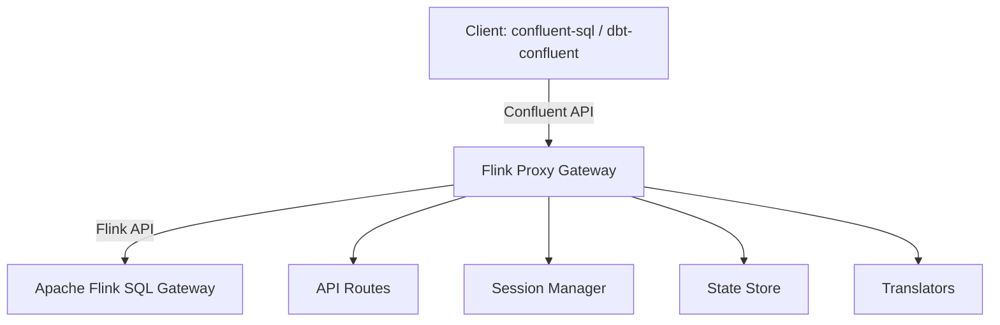
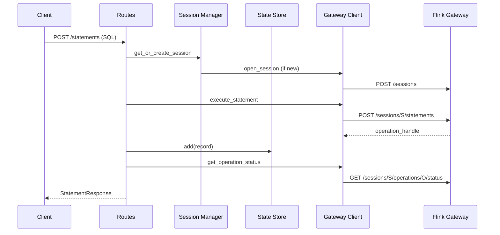

# Flink Proxy Gateway Architecture and Internal Documentation

This document provides a detailed overview of the Flink Proxy Gateway, explaining its components, their responsibilities, and how they interact to provide a Confluent Cloud Flink SQL API interface over an open-source Apache Flink SQL Gateway.

## 1. System Overview

The Flink Proxy Gateway acts as a translation layer. It allows tools like `confluent-sql` and `dbt-confluent` to interact with a standard Flink SQL Gateway without any client-side modifications. It handles the mapping of Confluent's statement-based model to Flink's session-and-operation model.

### High-Level Architecture

## 2. Core Components

### 2.1 API Routes (`src/flink_gateway_proxy/routes/`)
- **Responsibility**: Implements the Confluent Cloud Flink SQL API endpoints.
- **Key File**: `statements.py`
- **Functions**:
    - `create_statement`: Handles `POST /statements`. Orchestrates session acquisition, statement execution in Flink, trait inference, and initial state storage.
    - `get_statement`: Handles `GET /statements/{name}`. Polls Flink for status, updates the local state, and translates Flink status to Confluent phases.
    - `get_statement_results`: Handles `GET /statements/{name}/results`. Fetches results from Flink and translates them to the Confluent changelog format.
    - `delete_statement`: Handles `DELETE /statements/{name}`. Cancels/closes the Flink operation and removes the record from the state store.

### 2.2 Session Manager (`src/flink_gateway_proxy/session/`)
- **Responsibility**: Manages long-lived Flink SQL Gateway sessions.
- **Key File**: `manager.py`
- **Features**:
    - **Pooling**: Sessions are keyed by `(org_id, env_id, catalog, database)`. Multiple statements from the same environment share a session.
    - **Heartbeats**: Runs a background task to call `/heartbeat` on all active Flink sessions every 30s to prevent them from timing out in Flink.
    - **Cleanup**: Automatically closes sessions that haven't been used for 10 minutes.

### 2.3 State Store (`src/flink_gateway_proxy/state/`)
- **Responsibility**: Persists statement metadata and mapping information.
- **Key File**: `store.py`
- **Details**: Currently an **in-memory** implementation using a dictionary protected by an `asyncio.Lock`. It maps Confluent statement names to Flink `operation_handle`s and `session_handle`s.

### 2.4 Flink Gateway Client (`src/flink_gateway_proxy/gateway/`)
- **Responsibility**: Low-level async HTTP client for the Flink SQL Gateway REST API.
- **Key File**: `client.py`
- **Library**: Uses `httpx` for asynchronous requests.

### 2.5 Translators (`src/flink_gateway_proxy/translator/`)
- **Responsibility**: Complex logic for data structure conversion.
- **Modules**:
    - `status.py`: Maps Flink `INITIALIZED`, `RUNNING`, `FINISHED`, `CANCELED`, `FAILED` to Confluent `PENDING`, `RUNNING`, `COMPLETED`, `FAILED`.
    - `results.py`: Converts Flink `RowData` (with `RowKind`) into Confluent `ChangelogRow` format.
    - `traits.py`: Infers `sql_kind` from the SQL text and determines if a query is `bounded` or `append-only`.

## 3. Interaction Flows

### 3.1 Statement Execution Flow

### 3.2 Result Fetching and Translation

1.  Client requests results with a `page_token`.
2.  Proxy fetches results from Flink using the `operation_handle` and `token`.
3.  `translator/results.py` iterates over Flink rows:
    - Flink `+I` (INSERT) -> Confluent `INSERT`
    - Flink `-U` (UPDATE_BEFORE) -> Confluent `UPDATE_BEFORE`
    - Flink `+U` (UPDATE_AFTER) -> Confluent `UPDATE_AFTER`
    - Flink `-D` (DELETE) -> Confluent `DELETE`
4.  Next `page_token` from Flink is wrapped in an absolute URL for the Confluent response.

## 4. Key Implementation Details

### Boundedness Inference
Since Flink SQL can be both streaming (unbounded) and batch (bounded), the proxy must tell the client what to expect.
- DDL/DML (CREATE, INSERT, etc.) are always treated as **bounded**.
- `SELECT` is treated as **unbounded** unless the property `sql.snapshot.mode` is set to `now`.

### Session Lifespan
Sessions in Flink SQL Gateway are expensive but necessary for state (catalogs, temp views). The proxy keeps them alive via heartbeats as long as they are "active". If the proxy restarts, all in-memory statement records are lost, but sessions in Flink might persist until their own timeout (managed by Flink).

## 5. Deployment and Configuration

- **Environment Variables**:
    - `PROXY_FLINK_GATEWAY_URL`: Points to the OSS Flink Gateway.
    - `PROXY_SESSION_HEARTBEAT_INTERVAL`: Frequency of heartbeats (default 30s).
- **Docker**: The project includes a `Dockerfile` for containerization.
- **Kubernetes**: Manifests in `deploy/kubernetes/` provide a standard deployment pattern (Deployment, Service, ConfigMap).

---

> [!IMPORTANT]
> The current state store is **in-memory**. Scaling the proxy horizontally or restarting it will cause loss of active statement tracking. For production use, a persistent `StateStore` (e.g., Redis or PostgreSQL) should be implemented.
