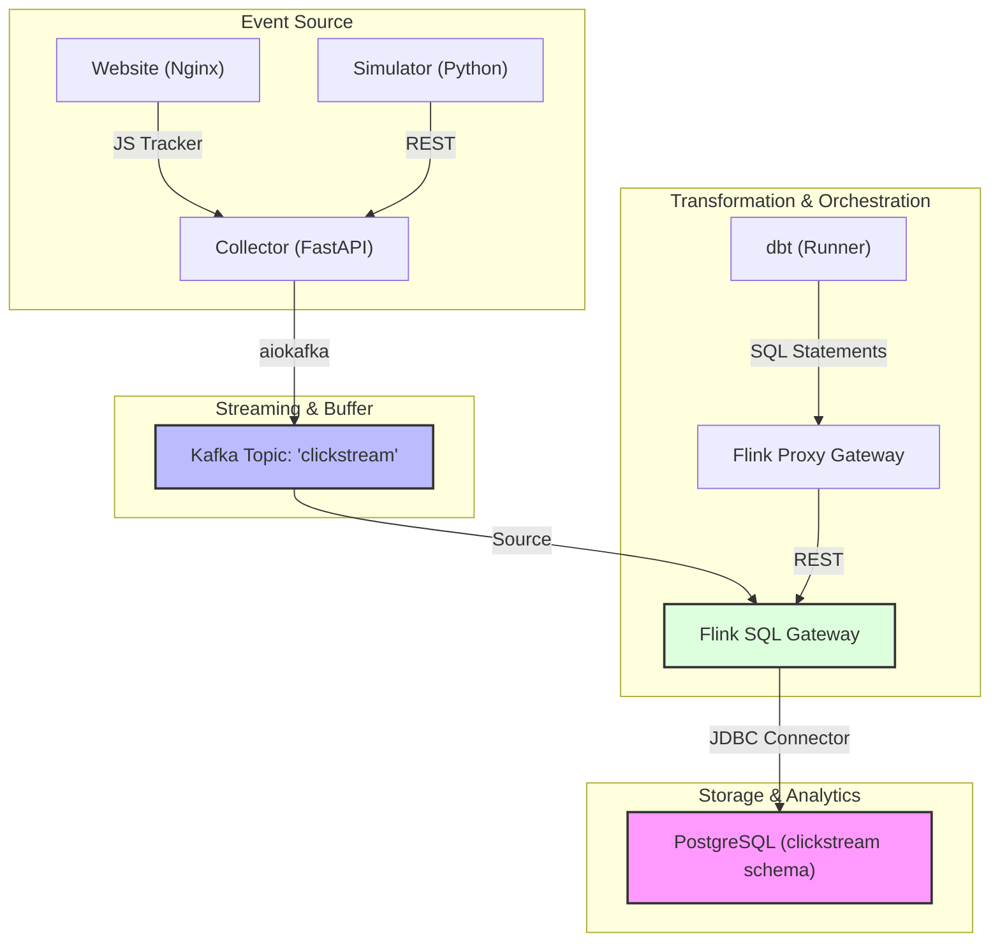

# POC: Real-Time Telemetry Pipeline (Kafka to PostgreSQL)

This document describes the Proof of Concept (POC) architecture for a real-time telemetry pipeline. It uses **Apache Kafka** as the source, **Apache Flink (orchestrated via dbt)** for transformation, and **PostgreSQL** as the operational data store for analytics.

## 1. High-Level Architecture

## 2. Component Breakdown

### 2.1 Ingestion Layer
*   **Website**: A static frontend that embeds `tracker.js`. It captures page views, clicks, and ecommerce events.
*   **Collector**: A lightweight FastAPI application. It validates incoming JSON payloads against a Pydantic schema and produces them to Kafka.
*   **Simulator**: A traffic generation tool used for load testing and verifying the pipeline without manual browser interaction.

### 2.2 Streaming Layer
*   **Apache Kafka**: Serves as the persistent message buffer. The `clickstream` topic is the single source of truth for raw events.
*   **Flink SQL Gateway**: The execution engine for streaming SQL. It maintains sessions and manages long-running Flink jobs.

### 2.3 Orchestration Layer (The "Dual-Gateway" Pattern)
To enable modern analytics engineering workflows (dbt) on top of open-source Flink, we use a proxy pattern:
1.  **dbt-confluent**: A dbt adapter designed for Confluent Cloud's Flink API.
2.  **Flink Proxy Gateway**: A custom translation layer that implements the Confluent API but talks to a standard OSS Flink SQL Gateway.

### 2.4 Data Warehouse: PostgreSQL
The final materialized views are pushed into **PostgreSQL** using the Flink JDBC connector.
*   **Target Table**: `clickstream.clickstream_analytics`
*   **Process**: Flink performs windowed aggregations (Tumble windows) and upserts the results into Postgres in real-time.

---

## 3. Data Flow Example: 'Add to Cart'

1.  **Tracker**: User clicks "Add to Cart" → `tracker.js` sends POST to `/events`.
2.  **Collector**: Validates schema → `producer.send('clickstream', event)`.
3.  **Kafka**: Stores event in partition.
4.  **Flink**: 
    - Consumes raw event from Kafka.
    - Parses JSON and maps to `clickstream_raw` table.
    - Executes `clickstream_summary` model (Tumble window by `session_id`).
    - Calculates `event_count` per minute.
5.  **PostgreSQL**: Receives JDBC update for the specific session/window.

## 4. Operational Considerations

### Error Handling
- **Dead Letter Queue (DLQ)**: Invalid events are rejected at the Collector level (FastAPI validation).
- **Restart Strategy**: Flink jobs are configured to resume from the last successful checkpoint if a TaskManager fails.

### Scalability
- **Kafka**: Can be scaled by increasing partitions.
- **Flink**: TaskManagers can be scaled vertically (more memory) or horizontally (more nodes).
- **Collector**: Can be scaled behind a load balancer.
